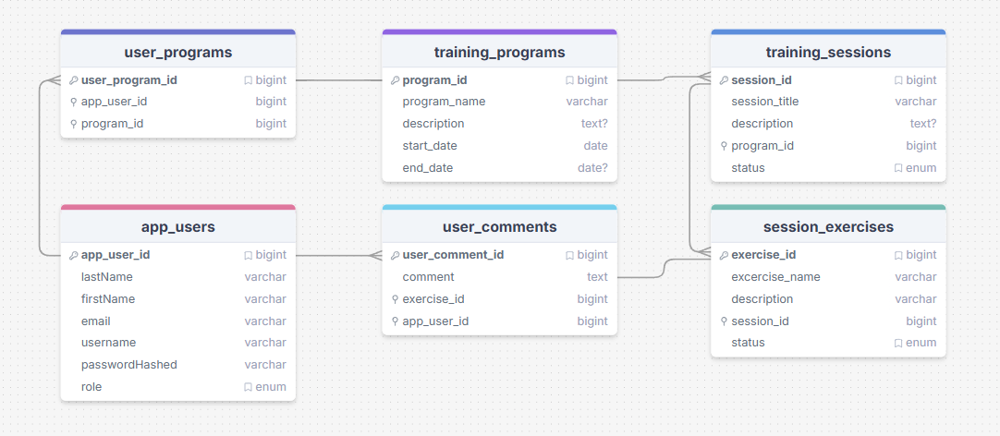

# physiomaari-app

This application is my practice project on my mobile programming course.

## Requirements

1. Coach can plan training programs for their clients and add the program to their client's calendar
2. The training plan consists of training sessions and a training session consists of separate exercises
3. Coach can link their own YouTube-videos to support written movement descriptions
4. Client can comment on sessions and mark them as "done"
5. All programs, sessions and their comments are saved in a database
6. Coach can see all programs and information about all clients
7. Client can only see their own training program and comment on their own sessions
8. Client has a calendar view, where all sessions are seen, completed sessions differently marked than not-completed sessions

### Additional features

1. System alerts coach when client comments on a session or marks it complete
2. System alerts client when coach updates training program or answers a comment

## Database plan

